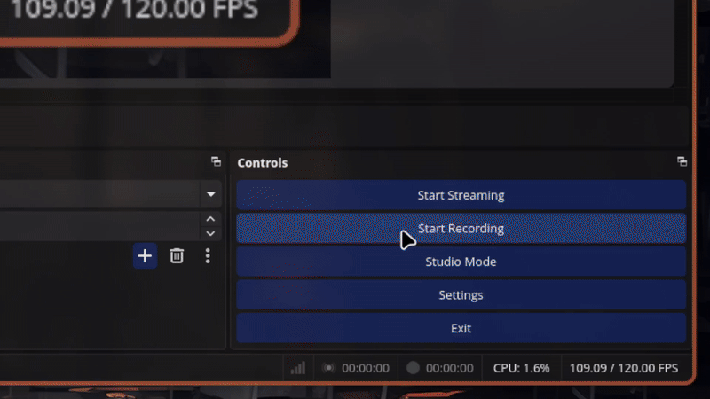

# OBS Hyprland Mouse Follow Script

A Lua script for OBS Studio that pans a scaled Display Capture to follow the mouse cursor on Hyprland. Ideal for creating smooth zoom-and-follow effects when screen recording or streaming.

## Features

- Smooth following using exponential smoothing
- Locks to display edges to avoid overscrolling
- Configurable zoom, output size, display size, and smoothing
- Designed for Hyprland (Wayland) using `hyprctl cursorpos`

## Requirements

- OBS Studio
- Hyprland with `hyprctl` in your `PATH`

## Installation

1. Open OBS Studio.
2. Go to `Tools` > `Scripts`.
3. Click `+` and select `hypr_mouse_follow.lua`.
5. Fill in the required fields: source name, display size, output size, etc.

## Configuration

After adding the script in OBS (via `Tools` > `Scripts` > `+`), you'll need to configure the following settings:

- **Source Name**  
  The exact name of the display capture source you want the script to control. Make sure it matches the source name in your current scene.

- **Display Width & Height**  
  The resolution of your physical display (e.g., 2560 for width and 1440 for height). This should match your monitor’s actual resolution.

- **Output Width & Height**  
  The size of the OBS output canvas or the portion you want to crop and zoom. Usually, this matches your streaming or recording resolution (e.g., 1920×1080).

- **Zoom Scale**  
  The factor by which the display capture is zoomed. For example, `1.5` means 150% zoom. Adjust this to control how tightly the capture follows the cursor.

- **Smoothing Factor**  
  Controls how smoothly the capture follows your mouse cursor.  
  - `1` means no smoothing (instant movement).  
  - Values close to `0` (e.g., 0.01) mean very slow, smooth movement.

- **Update Interval (ms)**  
  How often the script updates the position (in milliseconds). Lower values make the follow smoother but can use more CPU.

> **Note:**  
> If the script is lagging, try reloading it from the OBS Scripts menu (via `Tools` > `Scripts` > `+`)

I've only tested the script on my 2560x1440 display, however, there's no reason why it wouldn't work on other resolutions.

## Maintenance
I will be maintaining this script going forward, so get in touch if you have any issues or feature requests.

### Planned features
- [ ] Shortcut to toggle zoom in/out
- [ ] Shortcut to toggle following

## License

[GNU General Public License v3.0](LICENSE)
